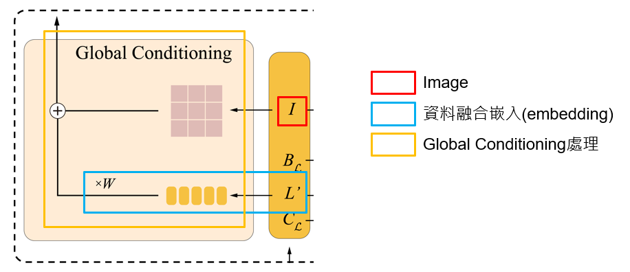

# 🧠 Summer Training Week 4 — Paper Code Mapping 

## 🎯 課程目標

本週目標為透過理解Paper架構圖之專案流程與論文內容，並學會追蹤對應程式碼模組與邏輯位置

---

## 🏗️ Paper與架構圖

本週選擇以下論文作為訓練樣本

**論文名稱**
[《LayoutDiffusion: Controllable Diffusion Model for Layout-to-image Generation》](https://openaccess.thecvf.com/content/CVPR2023/papers/Zheng_LayoutDiffusion_Controllable_Diffusion_Model_for_Layout-to-Image_Generation_CVPR_2023_paper.pdf)

**架構圖**


---

## 📋 作業內容

請根據架構圖區塊，找到程式碼中相應位置，並且寫成README進行上傳 (請依照範例格式填寫)

上傳內容須包含:

1. mapping.md (架構圖模組區塊與程式碼位置對應)
2. config.md（config設置意義說明與對應要求位置）

❗以下為各README需繳交的指定內容 (架構區塊已用不同顏色框起來)

### ✍️ mapping.md 說明內容

- 資料處理 (6個框框)


- Global Conditioning (3個框框)


- Local Conditioning (1個框框)


- 損失值 (Loss function)  
❗hint: 請依照Paper中Loss公式尋找

mapping.md填寫格式:

```bash
資料處理 (6個框框)
    -對應檔案: /LayoutDiffusion/XXX/XXX.py
        -X色框框:
            -被包在哪個class裡面: XXX (請寫class名稱)
            -確切行數位置: 第X行~第X行 or 第X行 (請自行分析判斷)
        -X色框框:
            -被包在哪個class裡面: XXX 
            -確切行數位置: 第X行~第X行 or 第X行
        -X色框框:
            -被包在哪個class裡面: XXX 
            -確切行數位置: 第X行~第X行 or 第X行
        -X色框框:
            -被包在哪個class裡面: XXX 
            -確切行數位置: 第X行~第X行 or 第X行
        -X色框框:
            -被包在哪個class裡面: XXX 
            -確切行數位置: 第X行~第X行 or 第X行
        -X色框框:
            -被包在哪個class裡面: XXX 
            -確切行數位置: 第X行~第X行 or 第X行

Global Conditioning (3個框框)
    -對應檔案: /LayoutDiffusion/XXX/XXX.py
        -X色框框:
            -被包在哪個class裡面: XXX 
            -確切行數位置: 第X行~第X行 or 第X行
        -X色框框:
            -被包在哪個class裡面: XXX 
            -確切行數位置: 第X行~第X行 or 第X行
        -X色框框:
            -被包在哪個class裡面: XXX 
            -確切行數位置: 第X行~第X行 or 第X行

Local Conditioning (1個框框)
    -對應檔案: /LayoutDiffusion/XXX/XXX.py
        -X色框框:
            -被包在哪個class裡面: XXX 
            -確切行數位置: 第X行~第X行 or 第X行

損失值
    -對應檔案: /LayoutDiffusion/XXX/XXX.py
        -被包在哪個class裡面: XXX
        -確切行數位置: 第X行~第X行 or 第X行

```

### ✍️ config.md 說明內容

❗hint: COCO、256、large、LayoutDiffusion

config.md填寫格式:

```bash
對應檔案: /LayoutDiffusion/XXX/XXX.yaml
    -要在哪裡設置訓練時所用到的資料集: XXX/XXX ... (請具體寫出該參數名稱的路徑 eg. model/XXX/...)
    -要在哪裡設置訓練時的整體總步數: XXX/XXX ...
    -要在哪裡設置訓練途中每多少步數可以做模型儲存: XXX/XXX ...
    -要在哪裡設置訓練模型的存放路徑: XXX/XXX ...
    -要在哪裡設置訓練時所使用的預訓練模型: XXX/XXX ...
```

---

## 📤 Github上傳方式

請依照以下步驟提交作業：

### 🪜 操作流程（Clone → Branch → Commit → PR）

```bash
# 1. Clone 作業倉庫
git clone https://github.com/ccuvislab/Summer-Training-Week4.git
cd Summer-Training-Week4

# 2. 建立你的個人分支（命名建議：student_你的名字/week4）
git checkout -b student_你的名字/week4

# 3. 建立個人資料夾（命名建議：student_你的名字_week4）
mkdir student_你的名字_week4
# 將所有作業內容放入該資料夾

# 範例資料夾結構
Summer-Training-Week4/
├ Images
│ LayoutDiffusion
└── student_你的名字_week4/
    ├── mapping.md
    ├── config.md

# 推送與發 PR
git add student_你的名字_week4/
git commit -m "finished week4 hw - code mapping"
git push origin student_你的名字/week4

# 注意事項
每位學生 只能修改自己資料夾
```

